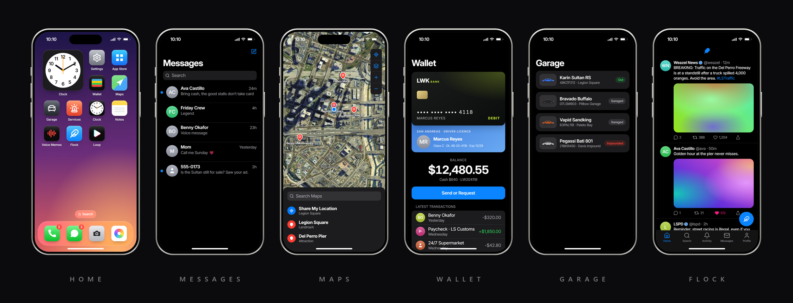

# LWK Phone

A free, open-source phone for FiveM by **LWK Development**. Twenty-six apps, voice and video calls, a full map of San Andreas, a phone that can be an item in your pocket, a theme file you can edit on a live server, and community apps that other resources add at runtime.



Works with **Qbox, QBCore, ESX, ox_core and standalone** servers (detected automatically), and brings players' numbers and data across from **[NPWD and GCPhone](#moving-from-another-phone)**.

## Features

- **Calls** with voice through your voice script, video calls, voicemail, Mute and Speaker, and switching between voice and video while the call is going.
- **Messages**: texts, photos, locations with a map of where you are, voice notes and money, one to one or in groups.
- **Camera and Photos.** Photos, selfies and video, a key to walk around with the camera up, and a library with albums and favourites.
- **Maps.** The whole of San Andreas ships with the phone as a road map and a satellite view, with places, waypoints and location sharing. No tile server to set up.
- **Wallet and Crypto.** Bank balance, transfers and requests, a history of phone payments, and made-up coins bought with bank money.
- **Garage.** Every vehicle a player owns and where it is, a valet that brings one to them, and impound fees paid from the phone.
- **Services.** Call or message the police, EMS, mechanics and any other job you list. Bosses hire, fire, change grades and move money in and out of the company account.
- **Home.** The houses a player owns, with a waypoint, the door lock and keys, on nine housing scripts.
- **Social apps with accounts**: Flock (short posts), Loop (short videos), Lumen (photos, stories and live video), Ember (swipe and match), Shade (anonymous channels), Mail, Adverts and Market. A player can hold several accounts and sign in from any phone.
- **The phone as an item.** On eight inventories the phone is an item, and on seven of them each item is its own phone: the number and all its data go with whoever holds it.
- **Moving from another phone.** Coming from NPWD or GCPhone, everyone keeps their number, and setup offers to bring their contacts, texts, calls, photos and notes across.
- **Community apps.** Other resources add apps with one export. Apps written for LB Phone run unchanged.
- **Themes.** One JSON file changes the font, colours, icons, wallpapers, frames and which apps a new phone starts with, without rebuilding.
- **Sounds.** Five ringtones, four text tones and effects (all CC0), with volume, Silent Mode and Do Not Disturb.
- **Translations**: English and French ship, and every string lives in `config/locales/<code>.json`.
- **A start-up report** in the server console: what the phone detected, anything in its way, and whether a newer version is out.

## Compatibility

Everything is detected automatically. Each one can also be forced in `config/config.lua`.

Each bridge was written from that script's own documentation or source code. If one misbehaves with your version, its bridge is a short section in `config/bridge/`, and `phonecheck` shows what the phone detected.

| Frameworks | Status | Notes |
| --- | :---: | --- |
| qbox | ✅ | |
| qb-core | ✅ | |
| esx | ✅ | |
| ox_core | ✅ | Groups are jobs and accounts are the bank. See [ox_core](#ox_core) |
| standalone | ✅ | One phone per player, no item. Wallet, Crypto, Garage and Services are hidden |
| custom | ⚠️ | Requires manual implementation (`config/bridge/framework.lua`, `config/bridge/client.lua`) |

| Inventories | Status | Notes |
| --- | :---: | --- |
| ox_inventory | ✅ | Each phone item is its own phone |
| qb-inventory | ✅ | Each phone item is its own phone |
| ps-inventory | ✅ | Each phone item is its own phone |
| codem-inventory | ✅ | Each phone item is its own phone |
| core_inventory | ✅ | Each phone item is its own phone |
| jaksam_inventory | ✅ | Each phone item is its own phone |
| tgiann-inventory | ✅ | Each phone item is its own phone |
| ESX's own inventory | ✅ | The phone is an item once the `items` table has a `phone` row. Its items carry no data, so the phone belongs to the character |
| none | ✅ | No item: every player simply has a phone |
| custom | ⚠️ | Requires manual implementation (`config/bridge/inventory.lua`) |

| Voice | Status | Notes |
| --- | :---: | --- |
| pma-voice | ✅ | |
| saltychat | ✅ | Mute does not silence you at the other end |
| mumble-voip | ✅ | |
| none | ✅ | Calls connect but carry no sound |
| custom | ⚠️ | Requires manual implementation (`config/bridge/voice.lua`) |

| Banking | Status | Notes |
| --- | :---: | --- |
| [lwk_bank](https://github.com/lwkjacob/lwk_bank) | ✅ | Company account. Phone payments show in the bank's activity |
| Renewed-Banking | ✅ | Company account. Phone payments are written to its history |
| qb-banking | ✅ | Company account. Phone payments are written to its history |
| wasabi_banking | ✅ | Company account. Phone payments are written to its history |
| okokBanking | ✅ | Company account |
| tgg-banking | ✅ | Company account |
| p_banking | ✅ | Company account |
| fd_banking | ✅ | Company account |
| tgiann-bank | ✅ | Company account |
| qb-management | ✅ | Company account |
| esx_society / esx_addonaccount | ✅ | Company account (`society_<job>`) |
| ox_core | ✅ | The group's own account (the group needs `hasAccount`) |
| any other | ✅ | Wallet still works: a player's balance is framework bank money with every bank. Only the company account is missing |
| custom | ⚠️ | Requires manual implementation (`config/bridge/banking.lua`) |

| Garages | Status | Notes |
| --- | :---: | --- |
| jg-advancedgarages | ✅ | A vehicle held in a police impound cannot be released from the phone |
| cd_garage | ✅ | Garages are shown by name |
| qb-garages | ✅ | |
| qbx_garages | ✅ | |
| esx_garage | ✅ | |
| esx_advancedgarage | ✅ | |
| lunar_garage | ✅ | |
| okokGarage | ✅ | |
| vms_garagesv2 | ✅ | An impounded vehicle is collected at the impound, not from the phone |
| ox_core's vehicles | ✅ | The valet's vehicle is spawned by ox_core |
| any other | ✅ | Works when it keeps its framework's usual columns, which most do. See [Garages](#garages) |
| custom | ⚠️ | Requires manual implementation (`config/bridge/framework.lua`) |

| Housing | List and waypoint | Lock the door | Keys |
| --- | :---: | :---: | :---: |
| nolag_properties | ✅ | ✅ | ✅ |
| vms_housing | ✅ | ❌ | ✅ (not when its keys are items) |
| rtx_housing | ✅ | ✅ | ❌ |
| bcs_housing | ✅ | ✅ (shell and IPL houses) | ✅ |
| RxHousing | ✅ | ❌ | ✅ |
| ps-housing | ✅ | ❌ | ✅ |
| qbx_properties | ✅ | ❌ | ✅ |
| qb-houses | ✅ | ❌ | ✅ |
| esx_property | ✅ | ✅ | ✅ |
| custom | ⚠️ | ⚠️ | ⚠️ |

A custom housing script requires manual implementation (`config/bridge/housing.lua`).

| Old phones | Number | Contacts | Texts | Calls | Photos | Notes |
| --- | :---: | :---: | :---: | :---: | :---: | :---: |
| NPWD | ✅ | ✅ | ✅ | ✅ | ✅ | ✅ |
| GCPhone | ✅ | ✅ | ✅ | ✅ | ❌ (it has none) | ❌ (it has none) |

| Other | Status | Notes |
| --- | :---: | --- |
| Apps written for LB Phone | ✅ | Run unchanged. See [Apps written for LB Phone](#apps-written-for-lb-phone) |
| Fivemanage | ✅ | Storage for photos, video, voice messages and voicemail |
| Key scripts | ✅ | qb-vehiclekeys and the scripts that answer its event (qbx_vehiclekeys and most others), cd_garage, okokGarage |

## Requirements

| Resource | Why |
| --- | --- |
| [ox_lib](https://github.com/overextended/ox_lib) | callbacks, key bindings |
| [oxmysql](https://github.com/overextended/oxmysql) | database (MariaDB 10.2+ or MySQL 8) |
| qbx_core, qb-core, es_extended or ox_core *(optional)* | your framework. Without one the phone runs standalone |
| [pma-voice](https://github.com/AvarianKnight/pma-voice), saltychat or mumble-voip *(optional)* | sound on calls |
| an inventory from the list above *(optional)* | the phone as an item |
| a [Fivemanage](https://fivemanage.com) token *(optional)* | the camera, voice messages, voice memos and voicemail |
| OneSync *(optional)* | Speaker on calls, AirShare, hiring, and locating a vehicle all need the server to know where players are |

## Installation

1. **Download** `lwk_phone.zip` from the [latest release](https://github.com/lwkjacob/lwk_phone/releases/latest) and extract the `lwk_phone` folder into your `resources`. Keep the folder name **`lwk_phone`** (if you download the source code instead, rename `lwk_phone-main`). Other scripts use that name to call its exports.
2. **Start it after** your framework, ox_lib, oxmysql, inventory and voice script, in `server.cfg`:
   ```cfg
   ensure ox_lib
   ensure oxmysql
   # ...framework, inventory, voice...
   ensure lwk_phone
   ```
3. **Give admins access** to the admin commands:
   ```cfg
   add_ace group.admin lwk_phone.admin allow
   ```
4. **Add the item** (skip this on standalone, or if you don't want the phone to be an item). See [Items](#items) below.
5. **Set an upload token** so the camera and voice messages work. See [Photos, video and voice messages](#photos-video-and-voice-messages).
6. **Remove your old phone** so two phones don't fight over the same key and command. Coming from NPWD or GCPhone? Leave its database tables where they are: see [Moving from another phone](#moving-from-another-phone).
7. **Restart the server.** The database tables are created automatically on first start; there is no SQL file to import.

That's it. Join the server and press the key under Escape (`` ` ``), or type `/phone`.

The built UI ships in `web/dist`, so Node is not needed to run the phone.

### Updating

The server console says when a newer version is out. Download the new `lwk_phone.zip` and replace the folder, keeping your own copies of the three files you may have edited: `config/config.lua`, `config/keys.lua` and `web/dist/theme.json`. Check the release notes for new config options. The database looks after itself: tables and columns are added on start and nothing is ever removed, so going back to the previous version is just putting the old folder back.

### Items

On a framework server with one of the [inventories](#compatibility) above, the phone is an item and **each item is its own phone**: the number is written onto the item and every bit of phone data is keyed by that number. Give the item away, or have it taken, and the phone goes with it.

**ox_inventory** (also used by Qbox and ox_core): `ox_inventory/data/items.lua`
```lua
['phone'] = { label = 'Phone', weight = 190, stack = false, consume = 0, client = { export = 'lwk_phone.usePhone' } },
```

**Every other inventory**: an item named `phone` in its item list (`qb-core/shared/items.lua`, the inventory's own list, or the `items` table on ESX), not stackable, usable, closing the inventory when used.

With several phones in a pocket, using one opens that one; where the inventory does not say which was used, the first is opened. To change any of this, see `item` in `config/config.lua`: `require = false` drops the item altogether, and `unique = false` keeps the item but ties the phone to the character.

### Photos, video and voice messages

These are uploaded to [Fivemanage](https://fivemanage.com). Put your API token in `config/keys.lua` (only the server reads that file), or set it in `server.cfg`:

```cfg
set lwk_phone_fivemanage "your-token"
```

Without a token the camera says storage is not set up, and everything else still works.

Pictures, video and voice messages in texts and posts are only accepted from the hosts in `upload.hosts` (your upload host by default). Without that limit, a player could send a link to a server of their own and collect the IP address of everyone whose phone displays it. Add a host there if you move your uploads elsewhere.

### Keys

| Key | What it does |
| --- | --- |
| `` ` `` (under Escape) | Open and close the phone. Players rebind it under Settings > Key Bindings > FiveM |
| `Left Alt` | Hand the mouse back to the game while the phone stays up, and again to take it back. In the camera it lets the mouse aim |
| `Enter` | Camera shutter |
| `Up` | Flip the camera |
| `Left Ctrl` | Walk around with the camera up. Press it again to stand still |

On a call, **Mute** stops the other end hearing you while people next to you still can, and **Speaker** lets anyone standing within a few metres hear the call and be heard on it.

## Configuration

Everything is in `config/config.lua`, with a comment on each option. The ones most servers touch:

| Option | What it does |
| --- | --- |
| `locale` | Language file from `config/locales/`. |
| `framework` | `auto` detects Qbox, QBCore, ESX or ox_core and falls back to standalone. |
| `autoInstallApps` | Whether community apps may install themselves on every phone, or always go to the App Store first (the default). |
| `bank` | Which bank script holds company money. `auto` finds it. |
| `keybind`, `command`, `walk`, `cursorKey` | How the phone opens and whether players can move with it out. |
| `item` | The phone item: which inventory, whether it is required, whether each item is its own phone. |
| `numbers` | Prefixes and length of phone numbers. |
| `calls` | Ring time and voice script. |
| `rtc` | STUN/TURN servers for video calls and live streams. Add a TURN server if video fails for players behind strict routers. |
| `map` | Leave it alone: the map of San Andreas ships with the phone. On a server with its own map, `image` is a URL to one picture that replaces it and `bounds` are the game coordinates of that picture's edges. |
| `places` | Places listed in Maps. |
| `companies` | Jobs that players can call or message from Services. |
| `garage` | Valet and impound fees, and whether impounded vehicles can be released from the phone. |
| `housing` | Which housing script is behind the Home app. `auto` finds it. |
| `transfer` | Bringing data across from an old phone. `none` switches it off. |
| `music` | Songs for the Music app (direct links to audio files). The app is hidden while the list is empty. |
| `crypto` | Made-up coins bought with bank money. |
| `mailDomain` | The part after `@` in Mail addresses. |

Secrets (the upload token and the log webhook) go in `config/keys.lua`, which only the server reads. Framework, inventory, bank, voice and housing differences live in `config/bridge/`, one file each.

Apps that a server cannot back are hidden rather than shown empty: Wallet, Crypto, Garage and Services on standalone, Home without a housing script, Music without songs.

### Checking your setup

A few seconds after it starts, the phone prints a report to the server console: its version and whether a newer release is out, and the framework, inventory, voice script, bank, garage columns, housing script, upload storage and database it found. Anything that will get in its way is listed underneath with a `!`, such as another phone script running, no upload token, or OneSync being off. Type `phonecheck` in the console to print it again.

### Language

The phone ships in English (`en`, the default) and French (`fr`). Set `locale` to the name of a file in `config/locales/`. To add a language:

1. Copy `config/locales/en.json` to `config/locales/<code>.json` (e.g. `de.json`). `"ui"` is the interface, `"server"` the messages that come from Lua.
2. Set `meta.name` to the language's own name and `meta.intl` to its locale code (e.g. `de-DE`). Dates and numbers follow it.
3. Translate the values, never the keys. Keep placeholders as they are: `{name}`, `{amount}` and `%s`. Where a line has several `%s`, they must stay in the same order.

Missing strings fall back to English, so a half-done translation still works. Pull requests with new languages are welcome!

### Theme

`web/dist/theme.json` sits beside `index.html`, so it can be edited on a live server without rebuilding (in the source tree it is `web/public/theme.json`). Anything in it is laid over the built-in look (`web/src/theme.default.json`); leave a key out to keep the default.

| Key | What it controls |
| --- | --- |
| `font` | CSS font stack. Must be a system font or the bundled Inter. |
| `iconRadius` | Icon corner radius as a fraction of size. `0.225` is a rounded square, `0.5` a circle. |
| `island` | `"pill"` or `"hole"` (a punch hole that widens only for calls, recording and music). |
| `frames` | Frame colours offered in Settings: `{ "id": "#hex" }`. |
| `wallpapers` | Wallpapers offered in Settings: `{ "id": "<any CSS background-image>" }`. |
| `colors.light` / `colors.dark` | Overrides for the colour tokens in `web/src/styles/base.css`, e.g. `{ "--blue": "#0b8a7a" }`. |
| `apps` | Per-app `name`, `bg`, `fg` and `icon` (an image URL), keyed by app id. |
| `defaults` | `dark`, `wallpaper`, `lockWallpaper`, `frame`, `apps`, `dock` for a fresh phone. |

`themes/slate.json` is a second look made with nothing but this file. Copy it over `theme.json` to use it.

### Sounds

The phone rings, and plays a tone for notifications, sent and received messages, the camera shutter and alarms. Five ringtones and four text tones can be chosen in Settings, which also has the volume and Silent Mode; Do Not Disturb stops the ringtone. Only the player holding the phone hears them.

The recordings are in `web/dist/sounds/`. To replace one, put an `.mp3` with the same name in that folder. To switch every sound off, set `ENABLED = false` in `web/src/sound.ts` and rebuild.

## Apps

A new phone starts with fifteen apps: Phone, Messages, Camera, Photos, Settings, App Store, Wallet, Maps, Garage, Services, Clock, Notes, Voice Memos, Flock and Loop.

The rest are in the App Store: Weather, Calculator, Mail, Music, Home, Lumen, Ember, Shade, Adverts, Market and Crypto. Change which apps start installed with `defaults.apps` and `defaults.dock` in the theme file. A phone that has already rearranged its home screen keeps its own list.

Flock, Lumen, Loop, Shade and Mail use accounts with a username and password, so a player can hold several, stay anonymous, and sign in from any phone.

## ox_core

ox_core is shaped differently from the other frameworks, so a few things read differently there:

- **Jobs are groups.** A character can be in several. Their job, as far as Services is concerned, is the group they have made active, or failing that their group of type `job`. On duty means having that group active. The top grade of a group (or a grade whose account role is `owner`) is the boss.
- **The bank is the character's default account**, and the company account is the group's own account (the group needs `hasAccount`). Phone payments show in ox_core's own transaction history.
- **The valet's vehicle is spawned by ox_core**, not by the player's game, so it stays that character's tracked vehicle. The model has to be one ox_core knows.
- **Coming from NPWD** works here too: ox_core runs NPWD itself, and the number it kept on each character is carried over.

## Moving from another phone

A server that switches to LWK Phone does not start from nothing. If the old phone's tables are still in the database, then:

- **Everyone keeps their number.** It moves the first time a character's phone loads, with nothing to do, and numbers that belong to characters who have not been back yet are held for them.
- **Setup offers the rest.** The first time a player opens the phone, it shows what it found on their old one (contacts, conversations, call history, photos, notes) and offers to transfer it or start fresh.

**To switch:**

1. Stop the server and remove the old phone from `resources` (or its `ensure` line). **Leave its tables in the database.**
2. Add LWK Phone and start the server. The start-up report says which old phone was found and how many numbers are being kept.

The old tables are only read, never changed, so nothing is lost if you go back. `transfer = 'none'` in `config/config.lua` switches all of this off.

A conversation belongs to two people: it comes across whole the first time either of them transfers, and is not brought over a second time when the other does. Social app accounts are not transferred, because passwords cannot be carried from one phone to another.

Only these two free phones are covered. Transfers from paid phones are not supported and are not planned. Fuck Quasar.

## Garages

Every garage script keeps vehicles in the framework's table (`player_vehicles` or `owned_vehicles`); they differ in which columns say where a vehicle is. The Garage app reads whichever of these the table has, so there is nothing to configure:

| Columns | Garage scripts |
| --- | --- |
| `in_garage`, `garage_id`, `impound` | jg-advancedgarages, cd_garage |
| `state`, `garage` | qb-garages, qbx_garages |
| `stored`, `parking`, `pound` | esx_garage and most ESX garages |
| `stored`, `garage` | esx_advancedgarage |
| `stored` | lunar_garage |
| `parking` beside the framework's own | okokGarage |
| `garage`, `garageSpotID`, `impound_date` | vms_garagesv2 |

A garage script that is not in this table still works if it keeps one of these sets of columns. `phonecheck` prints the columns the phone found. One with other columns needs `where` and `Bridge.vehicleOut` in `config/bridge/framework.lua` adjusted.

Set `garage.fromImpound = false` to stop the phone releasing impounded vehicles at all.

After the valet spawns a vehicle, keys are handed over through qb-vehiclekeys' event (which qbx_vehiclekeys and most key scripts also answer), cd_garage's and okokGarage's. Another key script goes in `Bridge.giveKeys` in `config/bridge/client.lua`.

## Housing

The Home app lists the houses a player owns, with a waypoint to each, and as much else as the server's housing script offers (see the [table](#compatibility) above). The app is hidden when there is no housing script.

A key is given to one of the player's contacts, and goes to whoever holds that phone number. With vms_housing, bcs_housing, ps-housing, qb-houses and esx_property that person has to be in the city at the time, because those scripts hand keys to a player rather than to a character.

Every script has its own short section in `config/bridge/housing.lua` (and the client half at the end of `config/bridge/client.lua`); adding another is a matter of copying one.

## Commands

| Command | Who | What |
| --- | --- | --- |
| `/phone` | everyone | Open and close the phone (the name is `command` in `config/config.lua`) |
| `phonecheck` | admins, console | Print the start-up report again |
| `phoneverify <app> <username> <1 or 0>` | admins, console | Give or take a verified badge on a social account |
| `phonepassword <app> <username> <password>` | admins, console | Reset a social account's password |
| `phoneprune <days>` | admins, console | Delete texts, calls, mail and posts older than that many days. Nothing is ever deleted by itself, and this cannot be undone |

Admins are players with the `lwk_phone.admin` ace.

## Exports

Names follow LB Phone's where the meaning is the same, so scripts written for that phone need little changing.

```lua
-- server
exports.lwk_phone:GetEquippedPhoneNumber(source)                 --> number or nil
exports.lwk_phone:GetSourceFromNumber(number)                    --> source or nil
exports.lwk_phone:HasPhoneItem(source)
exports.lwk_phone:IsInCall(source)
exports.lwk_phone:SendNotification(sourceOrNumber, { app = 'settings', title = '', content = '' })
exports.lwk_phone:SendMessage(from, to, text)                    -- `from` can be a name such as 'Bank'
exports.lwk_phone:SendMail({ to = 'name@lsmail.net', sender = 'City Hall', subject = '', message = '' })
exports.lwk_phone:AddTransaction(number, amount, label)          -- a line in Wallet history; move the money yourself
exports.lwk_phone:CreateCall(source, { number = '555-0142', video = false, hidden = false })

-- client
exports.lwk_phone:IsOpen()
exports.lwk_phone:ToggleOpen(open)                               -- true, false, or nil to toggle
exports.lwk_phone:SendNotification({ app = 'settings', title = '', content = '' })
exports.lwk_phone:AddCustomApp(app)                              -- see Community apps
exports.lwk_phone:RemoveCustomApp(identifier)
exports.lwk_phone:SendCustomAppMessage(identifier, data)
```

## Community apps

These work the way LB Phone's custom apps do, with the same names and shapes, so an app written for one ports to the other with little change.

A resource registers an app and points at its own HTML page. The phone loads that page in an iframe and adds a set of globals to it.

```lua
exports.lwk_phone:AddCustomApp({
    identifier = 'pizza',                 -- unique, not shown
    name = 'Pizza This',
    description = 'Order a pizza to wherever you are standing.',
    developer = 'Example',                -- optional
    ui = GetCurrentResourceName() .. '/ui/index.html', -- leave out for an app that only runs a function
    icon = 'https://cfx-nui-' .. GetCurrentResourceName() .. '/ui/icon.png',
    defaultApp = false,                   -- true installs it for everyone, if the server allows it (see below)
    landscape = false,                    -- open sideways, for games and video
    price = 0,                            -- bank money charged on install (free on servers without money)
    size = 412,                           -- kB, shown in the App Store
    images = {},                          -- App Store screenshots
    keepOpen = false,                     -- apps without a ui close the phone when tapped unless this is set
    onOpen = function() end,              -- also onClose, onUse, onInstall, onDelete
})
exports.lwk_phone:RemoveCustomApp('pizza')
exports.lwk_phone:SendCustomAppMessage('pizza', { action = 'orderReady', data = { minutes = 4 } })
```

An app is removed automatically when the resource that registered it stops.

Community apps appear in the App Store and players install the ones they want. `defaultApp = true` only puts an app straight on every home screen when the server sets `autoInstallApps = true` in `config/config.lua`.

### Apps written for LB Phone

These run unchanged, once the server has a resource called `lb-phone` for them to find. Every export of this phone already answers under that name; what is missing is only the name itself, which those apps list as a dependency and wait for. Create a folder named `lb-phone` next to `lwk_phone` containing one file, `fxmanifest.lua`:

```lua
fx_version 'cerulean'
game 'gta5'
description 'Lets apps written for LB Phone find lwk_phone'
dependency 'lwk_phone'
```

Start it after the phone and before the apps (`ensure lb-phone`, or put it in the same `[folder]`). Do not do this on a server that runs the real lb-phone. Some apps support several phones and have a setting for which one to use: set it to LB Phone.

Inside the app's page the same globals exist (`fetchNui`, `useNuiEvent`, `getSettings`, `components.*` and the older top-level `setPopUp`, `selectGallery` and friends), the page is sized the same way (the screen is 27.6rem wide), and the `'componentsLoaded'` message is sent once they are ready.

Beyond the custom-app exports, these also answer under that name. Client: `SendNotification`, `IsOpen`, `ToggleOpen`, `GetEquippedPhoneNumber`, `HasPhoneItem`, `IsDisabled`, `ToggleDisabled`, `OpenApp`, `CloseApp`, `CreateCall`, `IsInCall`, `AddContact`, `SaveToGallery`, `SetPopUp`, `SetContextMenu`, `ToggleHomeIndicator`, `ToggleLandscape`, `ToggleFlashlight`, `EnableWalkableCam`, `DisableWalkableCam`, `GetSettings`, `GetAirplaneMode`, `GetStreamerMode`, `FormatNumber`, and the callback trio. Server: `GetEquippedPhoneNumber`, `GetSourceFromNumber`, `HasPhoneItem`, `SendNotification`, `NotifyEveryone`, `SendMessage`, `SendCoords`, `SendMail`, `AddTransaction`, `AddContact`, `CreateCall`, `EndCall`, `IsInCall`, `GetSettings`, `HasAirplaneMode`, `GetSocialMediaUsername`, `FormatNumber`, `RegisterCallback`, `BaseCallback`.

Exports with no counterpart here (battery, custom numbers, music and live trays, posting to its social apps, and so on) answer `nil` and print one line in the console naming the export, so an app that calls one keeps running. In a page, `useCamera`, `components.fetchPhone`, `components.setMusicSelector`, the GIF picker and `GameMap` are not available.

### Inside the app's page

The globals exist once the page receives the message `'componentsLoaded'`.

```js
window.addEventListener('message', (e) => e.data === 'componentsLoaded' && start());
```

| Global | Use |
|---|---|
| `resourceName`, `appName`, `appIdentifier` | Who registered the app. |
| `settings` | `display.theme` (`"dark"` or `"light"`), `airplaneMode`, `streamerMode`, `doNotDisturb`, `sound`, `time`, `name`, `phoneNumber`. |
| `onSettingsChange(cb)` | Called when any of the above changes. |
| `fetchNui(event, data?, scriptName?)` | POST to your resource's NUI callback. Load initial data this way when the page starts. |
| `onNuiEvent(event, cb)` | Receives `SendCustomAppMessage` pushes shaped `{ action, data }`. |
| `sendNotification({ title, content })` | Phone notification from your app. |
| `createCall({ number, videoCall })` | Start a call. |
| `setApp(name)` | Open another app by name or id. |
| `formatPhoneNumber(n)` | Formats a number for display. |
| `components.setPopUp({ title, description, attachment, input, buttons })` | Alert with buttons (`title`, `color`, `bold`, `cb`). |
| `components.setContextMenu({ title, buttons })` | Action sheet. |
| `components.setContactSelector({ onSelect })` | Pick a contact. |
| `components.setGallery({ includeImages, includeVideos, multiSelect, onSelect })` | Pick from the photo library. |
| `components.setShareComponent({ type, data })` | Open the share sheet. |
| `components.setFullscreenImage(src)` | Show an image full screen. |
| `components.setHomeIndicatorVisible(bool)` | Hide the home indicator, for full-screen apps. |
| `components.saveToGallery(url)` | Save to the photo library; resolves with the new id. |
| `components.uploadMedia(type, blob)` | Upload `"Image"`, `"Video"` or `"Audio"`; resolves with its URL. |
| `components.createGameRender(canvas)` | Draws the game's picture into your canvas; `takePhoto()`, `startRecording(cb)`, `pause()`, `resume()`, `destroy()`. |
| `components.setEmojiPickerVisible({ onSelect })` | Emoji picker; `onSelect({ emoji })`. Pass `false` to close. |
| `components.setColorPicker({ onSelect, onClose })` | Colour picker; both receive a hex colour. |

The phone also sets `data-theme` on the page's `<html>` and three CSS variables, `--safe-top`, `--safe-bottom` and `--safe-left`, for the space the status bar, home indicator and (sideways) camera cut-out cover.

`web/public/example-app/` is a complete example in one HTML file with no build step.

## Logs

Put a Discord webhook in `config/keys.lua` (or `set lwk_phone_webhook "..."` in `server.cfg`) to log posts, money transfers, company account deposits and withdrawals, old-phone transfers and admin prunes. Leave it empty to turn logs off. `debug = true` in `config/config.lua` prints every request to the server console.

## Not built

- **Distance in Ember.** Everyone on the server is in the deck.
- **Recorded clips are the whole game view**, not cropped to the viewfinder.
- `GameMap`, `useCamera` and the music selector for community apps.

## Development

```bash
npm --prefix web install
npm --prefix web run dev        # the phone in a browser, on mock data, at localhost:5174
npm --prefix web run build      # output in web/dist, targets FiveM's older Chromium
```

In a browser the phone runs on mock data and never contacts a server; the dev panel on the left fakes what the game would send. In the console, `phone` exposes the store (`phone.openApp('maps')`).

Dev panel extras: **Network: fast / slow / fail** shows each app's loading placeholder and its "couldn't load" screen. **Pseudo-language** brackets and accents every translated string, so any plain text is hard-coded. **WebRTC loopback test** connects two peers inside the page.

Review sheet: `http://localhost:5174/?gallery=notes,mail,crypto` shows several apps side by side. Add `&theme=light`, `&tab=1`, `&push=1` or `&pseudo=1`.

### How the pieces talk

A phone is its number, and every table is keyed by number.

- UI to server: `rpc(name, data)` in `web/src/net.ts` → the NUI callback `rpc` in `client/main.lua` → `RPC[name](source, number, data)` in `server/*.lua`, which answers `{ ok = true, ... }` or `{ ok = false, error }`. Requests that need the game itself (waypoints, the camera) are handled on the client in `Local[name]`.
- Server to UI: `Phone.push(sourceOrNumber, { action = ... })` → `web/src/nui.ts`.
- Private data (contacts, notes, settings, photos) is saved generically: the UI sends any slice that changed, the server stores it as JSON.

```
config/         config.lua, keys.lua (server-only secrets), locales/, bridge/ (framework, inventory, banking, voice, housing, transfer)
shared/         util.lua (validation), locale.lua
server/         db.lua (schema), main.lua (phones, requests, storage), messages, calls, social, apps, transfer, check, exports
client/         main.lua (open/close, focus, the pipe to the UI), prop, camera, apps, exports
web/src/
  shell/        lock screen, home screen, Control Center, calls, dialogs
  apps/         one file per app (or small group); index.tsx is the registry
  store.ts      state and actions
  data.ts       mock data for the browser; these shapes are what the server sends
  net.ts        requests to the game        nui.ts   messages from the game
  rtc.ts        WebRTC (video calls, live)  gameview.ts   the game's picture in a canvas
  theme.ts, i18n.ts, pickers.tsx, ui.tsx, sound.ts
```

## Credits

- Made by **LWK Development**.
- Sounds are CC0. See `web/dist/sounds/CREDITS.txt`.
- Font: Inter (SIL Open Font License), bundled through Fontsource.
- UI libraries in the built bundle: React (MIT) and Lucide icons (ISC).
- The map in `tiles/` is the Grand Theft Auto V map, which belongs to Rockstar Games, cut into tiles by [VIRUXE/gtav-map-tiles](https://github.com/VIRUXE/gtav-map-tiles). This project is not affiliated with or endorsed by Rockstar Games.

## Support

Free support is available in the [LWK Development Discord](https://discord.gg/99EuV7rzSp). Please include your framework, inventory, voice script, the output of `phonecheck`, and any F8/server console errors.

## Recommended Hosting

I recommend and personally use [RocketNode](https://rocketnode.us/lwkdev) for hosting your FiveM server running this resource. Use code **LWKDEV** for 25% off.


---

## License

[GPL-3.0](LICENSE) © LWK Development.

You can use, modify and share LWK Phone freely, on any server. If you distribute it or a modified version, it must stay open source under the same license, with the full source code included, so it can't be encrypted, escrowed or made closed source.

Bundled third-party parts keep their own licenses (see Credits). The map pictures in `tiles/` are not covered by the GPL: they remain Rockstar Games' property.
